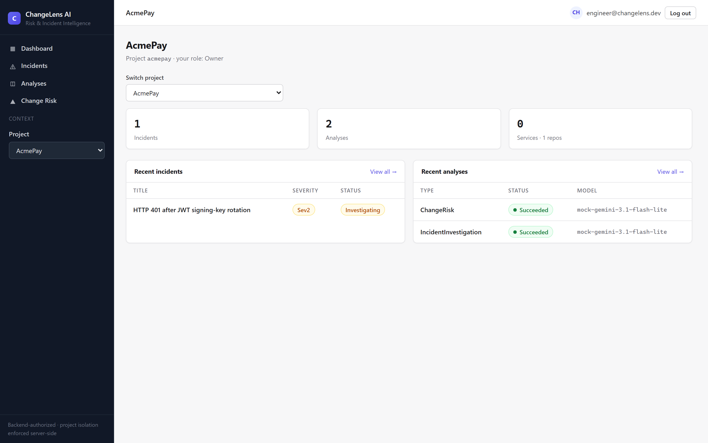
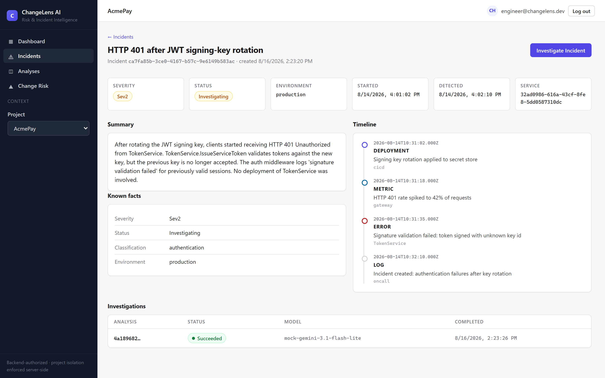
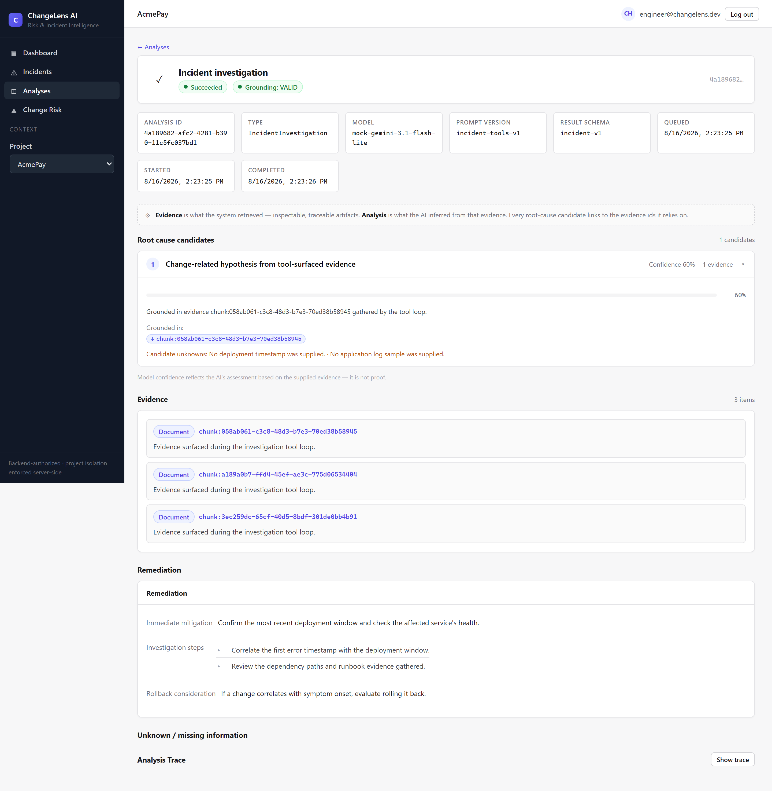
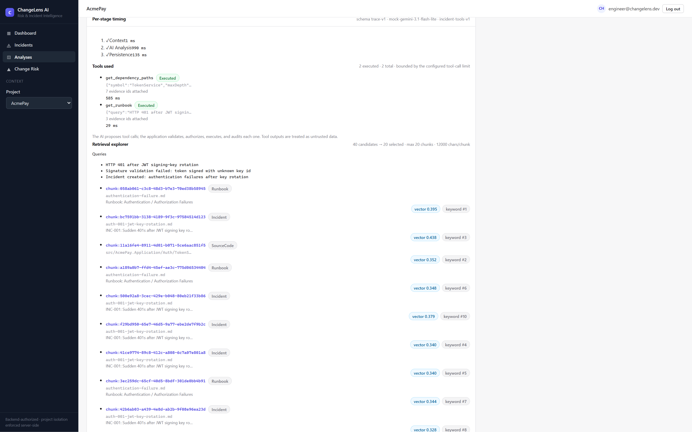
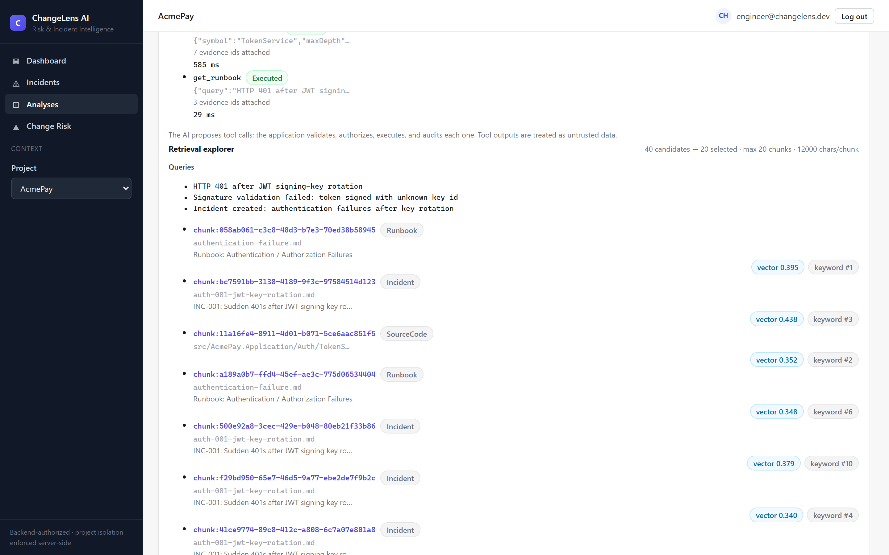
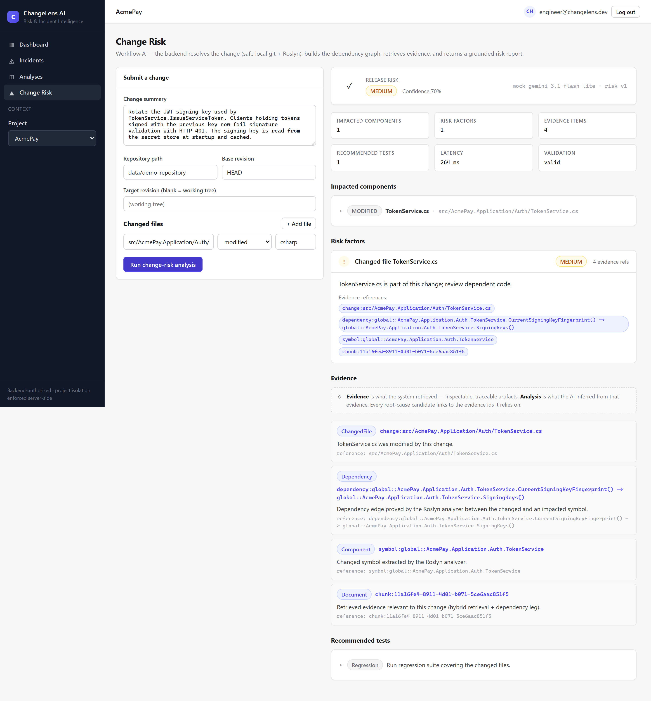
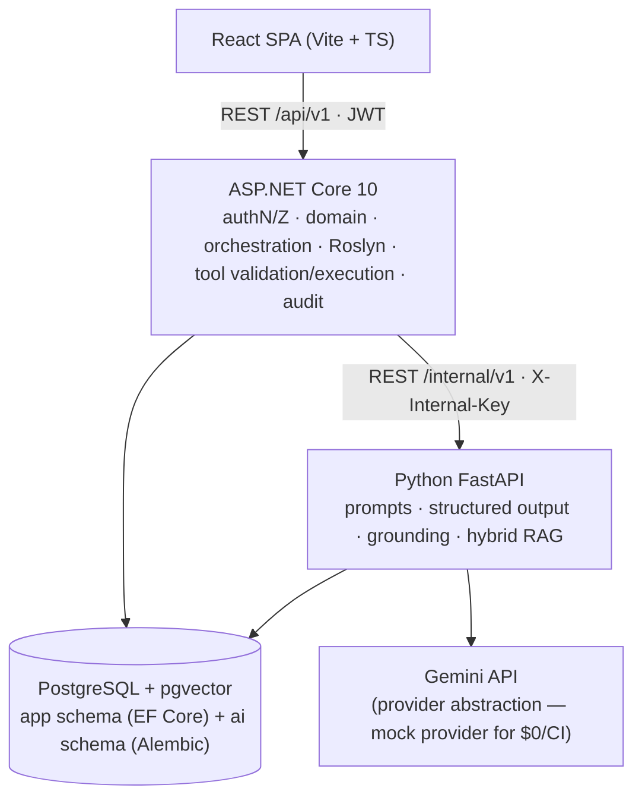

# ChangeLens AI

**An AI-powered production incident investigation and code-change risk intelligence platform combining hybrid RAG, Roslyn dependency analysis, grounded structured outputs, and controlled AI tool execution.**

## Overview

ChangeLens answers the two questions engineers ask around every production change: *"what could this change break?"* before a deploy, and *"what changed, what is likely affected, and what evidence supports the root cause?"* after something breaks.

It treats both questions as engineering problems: a code change becomes a **Roslyn symbol + dependency-graph model**; an incident becomes a **normalized context with a chronological timeline**. Hybrid retrieval then assembles evidence — historical incidents, runbooks, source code, and dependency-related documents — and a structured AI workflow produces **schema-validated, evidence-cited** conclusions with explicit unknowns.

Two complete workflows are implemented end-to-end: **async incident investigation** (202 → queued → running → grounded result with a controlled AI tool loop) and **change-risk intelligence** (git change → Roslyn → dependency paths → grounded risk report). Every AI conclusion is traceable to evidence the user can open, every stage of an analysis has real timings, and the system is honest about what it does *not* know. The whole platform runs at **$0** on local Docker + PostgreSQL + pgvector with mock providers, and the deterministic evaluation framework measures the retrieval and grounding decisions rather than assuming they work.

## Screenshots

> All screenshots were captured from the **real running application** (Docker stack, `http://localhost:8080`) using the **synthetic AcmePay demo dataset** (mock AI provider, zero Gemini calls). They are demo captures, not production data.

### Dashboard



*Project dashboard for the synthetic AcmePay project — incident/analysis counts, recent incidents and analyses, project role context.*

### Incident Investigation



*Incident detail for the canonical "HTTP 401 after JWT signing-key rotation" demo incident — severity, service, chronological timeline, and the async investigate action.*



*Completed incident investigation — grounded root-cause candidates with confidence and evidence IDs, remediation, and unknowns.*

### AI Observability & Retrieval



*Analysis trace — real per-stage timings (Context / AI Analysis / Persistence), tool calls, and the retrieval explorer showing which evidence entered the prompt.*



*Controlled AI tool loop — the model proposed, the application validated/authorized/executed: `get_dependency_paths` and `get_runbook`, with status and durations.*

### Change Risk Intelligence



*Change-risk result for the JWT signing-key rotation — risk level, confidence, impacted components, evidence, and validation status.*

## Problem

Post-incident reviews are slow because evidence is scattered: git history, deployment logs, runbooks, past incidents, and source code live in different tools with different vocabularies. Pre-deploy risk analysis is usually a manual reading of a diff. And while generic LLM/RAG systems can synthesize prose, they can also **hallucinate unsupported conclusions** — citing nothing the engineer can open and asserting confidence without evidence.

ChangeLens addresses both problems with the same architecture:

1. **Retrieval is hybrid and dependency-aware** — vector similarity alone is not enough for engineering evidence; keyword (exact identifiers like `TimeoutException`, `401`, `JWT`), metadata filters, and dependency relationships all matter.
2. **AI output is mechanically grounded** — every claim must cite evidence IDs that actually exist; empty or unknown evidence is rejected by a deterministic validator, and missing information is reported as unknowns instead of invented.

## What Makes It Different

1. **Hybrid RAG** — structure-aware chunking (tree-sitter for code, heading-aware for incidents/runbooks), pgvector cosine + PostgreSQL full-text keyword search + metadata filters + a dependency leg, merged with **RRF** (reciprocal rank fusion). Every SQL statement enforces hard project isolation.
2. **Roslyn change intelligence** — the .NET backend compiles the change with Roslyn, computes **changed symbols, impacted symbols, dependency edges, and bounded dependency paths** — exact, deterministic code intelligence feeding both retrieval and the risk model.
3. **Mechanical grounding** — a deterministic rule validates that every cited evidence ID exists and belongs to the project; empty/unknown evidence IDs are rejected. No LLM judge, no soft scoring — the contract is mechanical.
4. **Controlled AI tools** — the AI **proposes** tool calls; the application **validates arguments, authorizes against project scope, executes allowlisted read-only tools, and audits each call**. No SQL, no shell, no arbitrary URLs, no write tools.
5. **Async investigation workflow** — `POST /incidents/{id}/investigate` → **202 Accepted** with an analysis ID → persisted job state machine (Queued → Running → Succeeded/Failed) driven by a bounded, cancellable background worker with bounded concurrency, retry/timeout handling, and graceful shutdown.
6. **AI observability** — every analysis persists a trace: real stage timings, retrieval-leg attribution (which leg surfaced each chunk), tool-call trace with durations, prompt/model metadata, and normalized failure categories.
7. **Evaluation framework** — a deterministic runner against a **versioned 20-case golden dataset** measuring retrieval (Recall@K, Precision@K, MRR, Hit Rate per leg), grounding validity, schema validity, and tool-loop metrics — with an ablation mode that compares vector vs keyword vs dependency vs hybrid.

## Architecture



**Responsibility boundary:**

- **.NET (backend)** owns authentication, authorization, project isolation, domain truth, job orchestration, the async worker, Roslyn/dependency analysis, **tool validation, tool authorization, tool execution, and audit**.
- **Python (AI service)** owns the AI capability: embeddings, retrieval, prompt construction, provider abstraction, structured response validation, and grounding rules. It never executes tools and never owns domain state.
- **PostgreSQL + pgvector** holds both schemas: the EF Core `app` schema (projects, incidents, analyses, audit) and the Alembic `ai` schema (documents, chunks, embeddings).

## Core Workflows

### Workflow A — Incident Investigation

```
Incident → normalize context (timeline, symptoms, knowns/unknowns)
        → hybrid retrieval (vector + keyword + metadata + dependency → RRF)
        → controlled AI tool loop (propose → validate → authorize → execute → evidence)
        → grounding validation → root-cause candidates + remediation + unknowns
        → persisted analysis + trace
```

### Workflow B — Change Risk

```
Git change → Roslyn symbol analysis → changed/impacted symbols → dependency graph
          → hybrid retrieval → grounded risk report (risk level, confidence, factors, evidence)
```

## AI / RAG Architecture

- **Embeddings:** Gemini embeddings (`gemini-embedding-2`, 768-dim) behind an abstraction; a deterministic `MockEmbeddingProvider` powers tests, CI, and the $0 demo.
- **Chunking:** structure-aware — tree-sitter code chunking (C#, JS/TS, Python) and heading-aware chunking for incidents/runbooks, with content hashing for idempotent ingestion.
- **Retrieval legs:** pgvector cosine (vector), PostgreSQL FTS (keyword), metadata filters (service, environment, language, document type), and a dependency leg — combined with **RRF**.
- **Evidence budgets:** bounded candidate counts, selected-chunk limits, and per-chunk character caps, all recorded in the retrieval trace so "why did the model receive these N chunks?" is answerable.
- **Grounding:** every evidence ID in the AI output must exist in the retrieved set; the validator is mechanical, and the system rejects unsupported claims rather than inventing support.

## Controlled AI Tool Loop

```
AI proposes get_dependency_paths(...)
  → .NET validates arguments (types, UUIDs, bounds)
  → .NET checks authorization + project scope (never trusts AI-supplied scope)
  → .NET executes the allowlisted read-only tool
  → result is sanitized, given an evidence identity, audited, and traced
  → AI continues → final grounded result
```

Seven read-only, project-isolated tools exist: `get_incident`, `get_incident_timeline`, `get_service`, `get_runbook`, `get_source_symbol`, `get_dependency_paths`, and `search_evidence`. The loop is bounded (`AI_MAX_TOOL_CALLS`), each tool has a timeout, unknown tools are rejected (`TOOL_NOT_ALLOWED`), and tool outputs are treated as **untrusted data** — evidence, never instructions. There is deliberately **no** SQL, shell, arbitrary-URL, or write tool, and no multi-agent architecture: one reasoning loop, application-owned orchestration. See [docs/agent-tools.md](docs/agent-tools.md).

## Security

- **Authentication/authorization:** JWT (configurable issuer/audience/signing key), RBAC roles (Admin/Engineer/Viewer), project-level membership.
- **Project isolation:** enforced server-side on every query and every tool execution; cross-project access returns 404 (invisible), with explicit integration tests.
- **Tool safety:** allowlist registry, argument validation, bounded traversal, read-only scope.
- **Prompt-injection defense:** layered prompts where system rules precede evidence; adversarial tests confirm evidence text cannot grant capabilities.
- **Grounding:** mechanical evidence validation on every AI result.
- **Audit & logging:** append-only audit trail; structured logs never include API keys, JWTs, or authorization headers; safe error envelopes (no stack traces in responses).
- **Rate limiting:** in-memory limiter on analysis submission (documented single-instance), controlled CORS allowlist, non-dev secret validation on startup.
- **Secrets:** only `.env.example` templates are committed; real `.env` is gitignored; CI runs a secret scan. See [docs/security-model.md](docs/security-model.md).

## Evaluation

> **The evaluation is CLI-based, not a frontend dashboard.** Runner: `cd ai-service && python -m app.evaluation.run` (deterministic/mock providers, zero Gemini).

**Dataset:** 20 synthetic AcmePay cases · **Version:** `v1` · **Provider:** mock (deterministic, reproducible).

| Metric | Result |
| --- | --- |
| Cases evaluated | 20 / 20 |
| Schema-valid outputs | 20 / 20 |
| Grounded outputs (all evidence IDs valid) | 20 / 20 |
| Vector Recall@5 / @10 / MRR | 0.625 / 0.679 / 0.975 |
| Keyword Recall@5 / @10 / MRR | 0.529 / 0.546 / 1.000 |
| Hybrid Recall@5 / @10 / MRR | 0.583 / 0.617 / 1.000 |
| Dependency leg (retrieval-style queries) | 0 (change-model-driven; reported, not hidden) |
| Tool loop | 20/20 completed · 40/40 proposals valid · 20/20 grounded after tools |

**Honest caveats (stated plainly):** these measurements are from a **synthetic dataset using deterministic/mock providers** and should not be interpreted as production accuracy. In particular, **hybrid retrieval did not outperform vector retrieval on this dataset**; the evaluation framework is intended to measure such trade-offs rather than assume them. Full methodology: [docs/evaluation.md](docs/evaluation.md).

## Tech Stack

### Frontend
React 18 · TypeScript · Vite · React Router

### Backend
ASP.NET Core 10 · C# · Entity Framework Core · JWT · Roslyn · ASP.NET Identity

### AI Service
Python · FastAPI · Pydantic · Gemini API (provider abstraction) · tree-sitter

### AI
Hybrid RAG · pgvector embeddings · Keyword search (PostgreSQL FTS) · RRF · Structured outputs · Mechanical grounding · Controlled tool calling

### Code Intelligence
Roslyn (symbol analysis + dependency graph)

### Database
PostgreSQL + pgvector

### DevOps
Docker · Docker Compose · GitHub Actions ($0, mock-based)

## Repository Structure

```
frontend/    React SPA — login, projects, incidents, analyses, change risk, trace
backend/     ASP.NET Core 10 — domain, authz, orchestration, audit, Roslyn, tool execution
ai-service/  FastAPI — providers, prompts, structured output, hybrid RAG, evaluation runner
data/        demo corpus (AcmePay repo, incidents, runbooks) + golden dataset (v1)
docs/        architecture, ADRs, API contract, evaluation, security, agent tools, costs, demo script
scripts/     local PostgreSQL helpers + canonical AcmePay demo setup
.github/     $0 CI workflow (backend, Python, frontend, evaluation, secret scan)
```

## Quick Start

Prerequisites: Docker with Compose. Everything else is containerized.

```bash
git clone https://github.com/Priyanshu-47/ChangeLens-AI && cd ChangeLens-AI
cp .env.example .env
# Fill INTERNAL_API_KEY and JWT_SIGNING_KEY (any strong local values).
# For the $0 deterministic demo set:  AI_PROVIDER=mock  EMBEDDING_PROVIDER=mock
docker compose up -d --build          # postgres + ai-service + backend + frontend

# Seed the canonical AcmePay demo (project + incident + timeline + corpus + both workflows):
ai-service/.venv/Scripts/python scripts/acmepay_demo.py
```

Open **http://localhost:8080** and log in with a seeded **development/demo-only** account:

| Role | Email | Password |
| --- | --- | --- |
| Admin | `admin@changelens.dev` | `AdminPass!2026` |
| Engineer | `engineer@changelens.dev` | `EngineerPass!2026` |
| Viewer | `viewer@changelens.dev` | `ViewerPass!2026` |

> **Development/demo credentials only** — created by the local `Development` seeder; never use outside a dev/demo environment.

No Docker? `scripts/start-local-postgres.sh` starts a project-local PostgreSQL; then run backend, AI service, and frontend natively per their READMEs. Walk through the product in ~5 minutes with [docs/demo-script.md](docs/demo-script.md).

## Cost

- **Local Docker development:** $0 infrastructure.
- **Gemini:** free-tier dependent (and only when you explicitly configure the real provider).
- **CI:** $0 (mock providers + PostgreSQL service container in GitHub Actions).
- **AWS:** not deployed — documented as future architecture only.

The project is designed for a **$0 local development/demo setup**; no "free forever" or "zero-cost production" claim is made.

## Gemini Limitation

**Current configured text model:** `gemini-3.1-flash-lite` · **Embedding model:** `gemini-embedding-2` (768-dim).

The current live **structured-output** request against `gemini-3.1-flash-lite` returns **HTTP 400 INVALID_ARGUMENT** (a provider/model schema-compatibility issue). Therefore:

- Live Gemini incident analysis is **not** claimed to work.
- Normal tests, CI, and evaluation use `MockAIProvider` / `MockEmbeddingProvider` (deterministic, $0).
- The `IAIProvider` abstraction keeps the model provider replaceable; the embedding path with `gemini-embedding-2` was separately verified.
- Resolving the structured-output schema compatibility is a documented follow-up, not a hidden gap.

## Production / AWS

The current project is a **local Docker deployment**. A future AWS architecture is documented only (no resources were created, no charges incurred):

```
CloudFront/S3 → ALB → ECS/Fargate → RDS PostgreSQL   (AI provider remains external)
```

See [docs/deployment-strategy.md](docs/deployment-strategy.md) for what would change for multi-instance workers, a distributed queue, and secrets management.

## Limitations

- **Live Gemini structured output:** `gemini-3.1-flash-lite` rejects the current structured-output schema (HTTP 400); provider abstraction intact, mock path fully works.
- **Single-instance, in-process** async queue and rate limiter (no Redis/Kafka; deliberate MVP scope).
- **No hosted deployment** — local Docker is the official MVP; AWS is future architecture only.
- **Synthetic evaluation dataset** — measured with deterministic/mock providers; explicitly *not* production accuracy, and hybrid does not beat vector on it.
- **No production users/traffic/accuracy claims.**
- **Evaluation UI intentionally not implemented** — evaluation is CLI-based (`python -m app.evaluation.run`) with JSON/Markdown reports.

## Future Roadmap

Concise (see [docs/future-roadmap.md](docs/future-roadmap.md) for details): resolve Gemini structured-output compatibility · real-Gemini evaluation · persistent dependency graph · reranker only if evaluation justifies it · GitHub integration/webhooks · distributed queue · human approval for higher-risk tools · AWS deployment. None of these are implemented.

## Documentation

| Document | Contents |
| --- | --- |
| [docs/architecture.md](docs/architecture.md) | Architecture, diagrams, workflows, key decisions |
| [docs/rag-architecture.md](docs/rag-architecture.md) | Chunking, embeddings, hybrid retrieval, RRF |
| [docs/evaluation.md](docs/evaluation.md) | Metrics, dataset, runner, trace architecture, limitations |
| [docs/security-model.md](docs/security-model.md) | AuthN/AuthZ, prompt-injection defense, secrets, audit, production checklist |
| [docs/agent-tools.md](docs/agent-tools.md) | Tool loop: registry, safety, trace, audit, evaluation |
| [docs/deployment-strategy.md](docs/deployment-strategy.md) | $0-first local Docker, free tiers, AWS path |
| [docs/costs.md](docs/costs.md) | Cost model — local $0, Gemini free tier, optional AWS |
| [docs/demo-script.md](docs/demo-script.md) | 3–5 minute interview demo |
| [docs/api-contract.md](docs/api-contract.md) | REST conventions, endpoint catalog, async job pattern |
| [docs/interview-prep.md](docs/interview-prep.md) | Interview Q&A reflecting the actual implementation |
| [docs/resume-bullets.md](docs/resume-bullets.md) | Resume bullets and project versions |
| [docs/project-description.md](docs/project-description.md) | Short/long project descriptions |
| [docs/future-roadmap.md](docs/future-roadmap.md) | CURRENT / NEXT / FUTURE roadmap |
| [docs/screenshots/README.md](docs/screenshots/README.md) | Screenshot provenance (real app, synthetic data) |

## Status

**Phases 0–10 complete — portfolio ready.** The full four-service stack runs on Docker (installed and verified end-to-end: `docker compose up --build`, clean-start with migrations on startup, canonical AcmePay demo executed against the real containers), all test suites green (187 .NET unit · 53 .NET integration · 157 Python unit · 12 Python DB · 34 React tests + production build), and the evaluation runner produces measured reports with per-case tool traces. No AWS resources were created.
