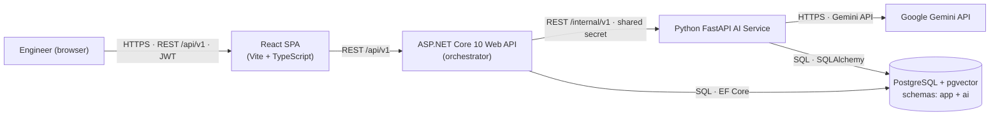
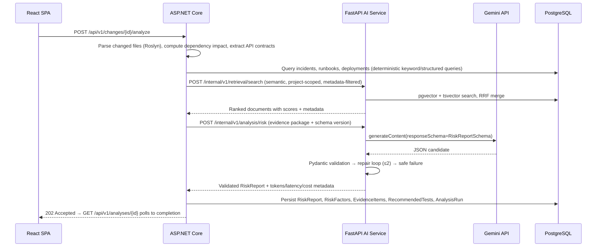
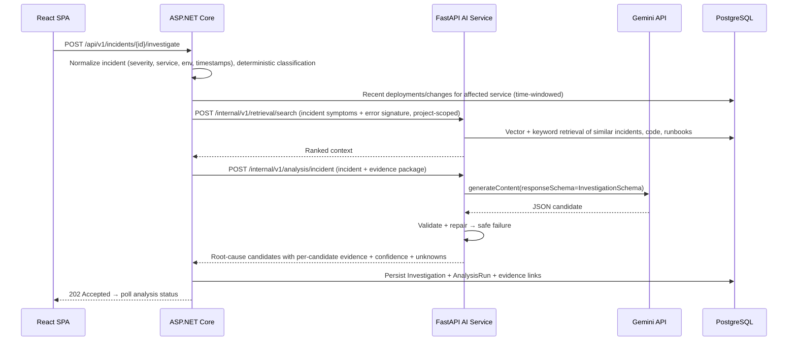

# Final Architecture — ChangeLens AI

> Phase 0 deliverable. This document is the single source of truth for the target architecture. Supporting decisions live in [ADR-0001..0012](adr/) and are referenced inline.

## 1. Purpose and principles

ChangeLens AI answers two questions for engineering teams:

- **Workflow A (pre-deploy):** *"What could this code change break?"* → structured risk report.
- **Workflow B (post-incident):** *"Something broke. What changed, what is likely affected, and what evidence supports the possible root cause?"* → structured investigation with evidence/hypothesis/unknown separation.

Architecture principles:

1. **Correct architecture > quantity of code > number of AI features.**
2. **$0-first.** Local Docker, PostgreSQL + pgvector, Gemini free tier. AWS is a later target, never an MVP dependency.
3. **Deterministic by default.** The LLM reasons over evidence; it never parses files, computes dependencies, or queries the database. Those are code.
4. **Evidence grounding.** Every major conclusion references retrievable evidence. No unsupported claims, no fabricated metrics.
5. **Structured outputs.** Main analysis results are schema-validated JSON with bounded repair and safe failure.
6. **Untrusted data.** All ingested content (source files, READMEs, logs, incidents) is data — prompt-injection is a first-class threat.
7. **Replaceable AI.** LLM and embedding providers sit behind abstractions so Gemini can be swapped for OpenAI/Bedrock without application rewrites.

## 2. System context



**Rule:** the frontend talks only to the ASP.NET Core API. The .NET backend talks only to the AI service. Only the AI service talks to Gemini. This keeps auth, authorization, domain logic, and audit in one place and makes the AI provider swappable.

## 3. Component responsibilities

| Component | Responsibilities | Explicitly NOT responsible for |
| --- | --- | --- |
| **React SPA** | Dashboard, change analysis, incident investigation, dependency graph, evidence inspection, AI evaluation + trace views | Business logic, direct AI calls, persistence |
| **ASP.NET Core API** | Identity (JWT), role + project authorization, projects/repositories/incidents/deployments domain, **change parsing + static analysis (Roslyn)**, **dependency graph computation**, **API contract extraction**, workflow orchestration (A & B), evidence assembly, app-schema persistence, audit log, AI run metadata | Embeddings, vector search, LLM calls, document chunking |
| **FastAPI AI Service** | Document ingestion + **semantic chunking** (tree-sitter / structure-aware), embeddings, **hybrid retrieval** (vector + keyword + metadata), reranking, **structured LLM reasoning**, tool-call proposals (Phase 6), evaluation runs, ai-schema persistence | Domain truth, authn/authz, orchestration, persistence of business entities |
| **PostgreSQL + pgvector** | Single local database, two schemas (see §6) | — |
| **Gemini API** | Text generation with structured outputs (`responseSchema`), embeddings | — |

**Why a separate AI service instead of a .NET-only stack?** The spec mandates it, and it is technically sound: the Python ecosystem (tree-sitter grammars, sentence-transformers, cross-encoders, Pydantic) is the pragmatic home for ingestion/retrieval/LLM orchestration, and it keeps the AI layer replaceable without touching the .NET domain. The cost is an extra runtime and a network contract, which the internal API boundary (§5) and ADR-0002 mitigate.

## 4. Workflow sequence diagrams

### Workflow A — Change Risk Analysis



### Workflow B — Incident Investigation



Both workflows share the same backbone: **deterministic preprocessing in .NET → hybrid retrieval in the AI service → one structured LLM call over an evidence package → schema validation → persistence with evidence links and full AI-run metadata.**

## 5. Service boundaries and contracts

### .NET → AI service (internal API)

| Endpoint | Purpose |
| --- | --- |
| `POST /internal/v1/ingest/documents` | Chunk + embed + store documents (code, incidents, runbooks, OpenAPI, markdown) |
| `POST /internal/v1/retrieval/search` | Hybrid retrieval: vector + keyword + metadata filters → ranked results |
| `POST /internal/v1/analysis/risk` | Structured risk report over an evidence package |
| `POST /internal/v1/analysis/incident` | Structured incident investigation over an evidence package |
| `POST /internal/v1/evaluations/run` | Run evaluation over the golden dataset (Phase 7) |
| `GET /internal/v1/health/live`, `GET /internal/v1/health/ready` | Liveness / readiness (includes LLM config probe) |

Full request/response schemas: [docs/ai-service-boundary.md](ai-service-boundary.md). Contract versioning: both sides pin `X-Contract-Version`; breaking changes bump the version and are coordinated across releases (single repo makes this cheap).

### Where orchestration lives

The **ASP.NET Core API orchestrates both workflows**. The AI service is a *capability provider*: it never decides which change to analyze, never stores business entities, and never calls tools on its own. Tool definitions (Phase 6) live in .NET; the AI service proposes tool calls, .NET validates, authorizes, executes, and audits them. See [ADR-0002](adr/0002-service-boundary.md) and [ADR-0008](adr/0008-controlled-tool-use.md).

## 6. Data architecture

Single PostgreSQL instance with two logical schemas — deliberately, not two databases:

```
postgres:5432/changelens
├── app schema (owned by EF Core migrations)
│   └── business entities: projects, repositories, services, components, dependencies,
│       pull_requests, changed_files, incidents, incident_events, deployments,
│       risk_reports, risk_factors, recommended_tests, evidence_items,
│       analysis_runs, incident_investigations, evaluations, audit_logs, users
└── ai schema (owned by SQLAlchemy migrations)
    └── documents, document_chunks, embeddings (vector + model + version)
```

Rationale: one container, one backup, $0, and pgvector on the same instance. Cost: schema-ownership discipline and no independent scaling — acceptable at portfolio scale. See [ADR-0003](adr/0003-single-postgres-schema-per-service.md). The `embeddings` table is keyed by `(chunk_id, model, version)` so retrieval can be compared across embedding models and documents can be re-indexed when the model changes.

## 7. Key decisions (index)

| # | Decision | Where |
| --- | --- | --- |
| 1 | Monorepo, three deployable units | [ADR-0001](adr/0001-monorepo-layout.md) |
| 2 | .NET orchestrates; FastAPI is a capability provider | [ADR-0002](adr/0002-service-boundary.md) |
| 3 | One PostgreSQL instance, two schemas, pgvector | [ADR-0003](adr/0003-single-postgres-schema-per-service.md) |
| 4 | Hybrid retrieval (vector + keyword + metadata + RRF) | [ADR-0004](adr/0004-hybrid-retrieval.md) |
| 5 | LLM provider abstraction, Gemini first | [ADR-0005](adr/0005-llm-provider-abstraction.md) |
| 6 | Embedding provider abstraction (Gemini / local) | [ADR-0006](adr/0006-embedding-provider-abstraction.md) |
| 7 | Structured AI output with schema validation + repair | [ADR-0007](adr/0007-structured-output-schema-validation.md) |
| 8 | Controlled single-agent tool use, executed in .NET | [ADR-0008](adr/0008-controlled-tool-use.md) |
| 9 | Long AI analyses run as async jobs (202 + poll) | [ADR-0009](adr/0009-async-analysis-jobs.md) |
| 10 | Evaluation is a first-class feature with a golden dataset | [ADR-0010](adr/0010-evaluation-first-class.md) |
| 11 | Static analysis in .NET (Roslyn); chunking in AI service (tree-sitter) | [ADR-0011](adr/0011-static-analysis-vs-chunking.md) |
| 12 | Identity + JWT, RBAC + project-level authorization | [ADR-0012](adr/0012-auth-model.md) |

## 8. Deliberate exclusions (MVP)

- **No separate vector database** (Pinecone/Qdrant/Weaviate) — pgvector on the same instance is sufficient and free. [ADR-0003]
- **No message broker** (Redis/Kafka/SQS) — ingestion and analysis are synchronous-or-job-based; SQS is only a Phase 10 async option. No demonstrated requirement in MVP.
- **No multi-agent framework** — a single controlled tool-using loop covers both workflows; multi-agent would be marketing, not engineering. [ADR-0008]
- **No LangChain/LlamaIndex dependency** — the RAG pipeline here is small, and owning it makes evaluation, prompt injection defense, and observability explicit and testable.
- **No real GitHub integration in MVP** — changes are submitted via API/demo data; GitHub App integration is a post-MVP option. Roslyn parses the actual files either way.

## 9. Deployment targets

| Target | When | What |
| --- | --- | --- |
| Local Docker (compose) | Phase 1 (postgres) → Phase 9 (all) | `frontend`, `backend`, `ai-service`, `postgres` |
| Free-tier demo | Post-MVP | Static frontend on free hosting; APIs either free-tier compute (cold starts accepted) or recorded demo; documented in [deployment-strategy.md](deployment-strategy.md) |
| AWS | Phase 10, only when local is stable | CloudFront+S3, container compute, managed PostgreSQL, S3, SQS, CloudWatch, Secrets Manager, Cognito — modular IaC, cost-estimated before anything is provisioned |

Full detail: [docs/deployment-strategy.md](deployment-strategy.md).
