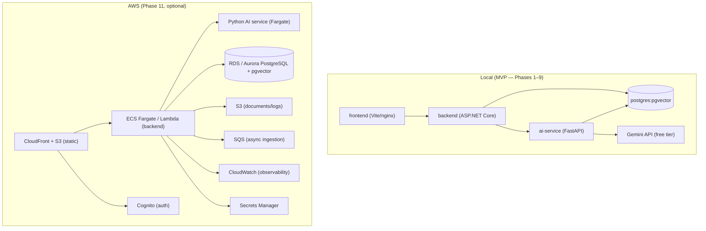

# Deployment Strategy — $0-first

> Phase 0 deliverable. Local first, free tiers for demo, AWS as a later, modular, cost-estimated target. **Nothing in the MVP path requires paid infrastructure.**

## 1. Target states

## 2. Local Docker (the MVP deployment) — Phase 9 complete

`docker compose up --build` runs the full four-service stack (`frontend`, `backend`, `ai-service`, `postgres`):

| Service | Image strategy | Notes |
| --- | --- | --- |
| `postgres` | `pgvector/pgvector:pg18` (pgvector bundled) | Named volume `pgdata`; healthcheck gates dependents; single instance hosts `app` + `ai` schemas |
| `backend` | Multi-stage .NET 10 SDK→runtime | Non-root user; waits for postgres health; DB-gated healthcheck (`/api/v1/health`); exposes `:5000` |
| `ai-service` | Python slim + requirements | Internal network; port exposed on the host **for local dev only** (remove `ports:` before any shared deployment) |
| `frontend` | Multi-stage React build → `nginx-unprivileged` (non-root, `:8080`) | Serves the SPA and proxies `/api/` to the backend — production is same-origin, no CORS |

Secrets flow via `.env` (compose reads it); `docker compose up` requires `INTERNAL_API_KEY` and `JWT_SIGNING_KEY` to be set (see `.env.example`). Devs can also run backend / AI service natively against the postgres container (or `scripts/start-local-postgres.sh`).

## 3. Free-tier demo options (post-MVP, all evaluated against cold-start/persistence limits)

| Option | Fits | Constraints to document in README |
| --- | --- | --- |
| **Render / Railway free tiers** | backend + AI service | Ephemeral disk, cold starts, free-tier expiry — demo quality varies; re-seed on start |
| **Static frontend free hosting** (GitHub Pages / Cloudflare Pages / Vercel) | SPA only | Needs a backend URL; only useful paired with one of the above |
| **GitHub Codespaces / devcontainer** | Full local demo, zero hosting | The most honest demo: `docker compose up` in a codespace |
| **Personal VPS (~$5/mo)** | All-in-one self-host | Lowest-cost always-on option; documented with a compose `prod` profile |

**MVP decision:** the primary demo is local Docker (+ a seeded demo dataset + [docs/demo-script.md](demo-script.md)). Free-tier hosting is a documented *option*, not a promise — portfolio honesty rule: never present ephemeral free hosting as production. **Docker verification status:** the compose stack is statically validated in this environment; `docker compose up --build` must be run where Docker is available (see the Phase 9 exit criteria in development-sequence.md).

## 4. AWS path (Phase 11 — modular, cost-estimated, never provisioned early)

- **Frontend:** CloudFront + S3 static hosting (cents/month at demo scale).
- **Backend:** ECS Fargate (or Lambda for the API if it fits the cold-start tolerance); ALB only if a public entry point is needed (note NAT/ALB costs explicitly).
- **AI service:** Fargate task, only scaled during eval/demo windows; Gemini API directly (no Bedrock cost in MVP; Bedrock is the provider-abstraction option).
- **PostgreSQL:** RDS/Aurora Serverless v2 (auto-pause) or self-managed on EC2 spot — decision is a Phase 11 cost analysis, not an assumption.
- **Async ingestion:** SQS (only when ingestion load justifies it — currently `202` jobs cover it).
- **Secrets:** Secrets Manager (Gemini key, JWT key, DB creds). **Auth:** Cognito (replaces local Identity at the boundary; ADR-0012 notes the seam).
- **Observability:** CloudWatch Logs + metrics; **IaC:** Terraform modules kept per-service so nothing is "all-or-nothing".

**Hard rule:** no AWS resource is created until the local MVP is stable, a cost estimate accompanies each module, and the user approves. The architecture is AWS-compatible (ADR-0001..12) without being AWS-dependent.

## 5. Cost ledger (MVP)

| Item | Cost |
| --- | --- |
| PostgreSQL + pgvector (local container) | $0 |
| Gemini API free tier (text + embeddings) | $0 (rate-limited) |
| GitHub repo + Actions (public) | $0 |
| Docker Desktop / Podman | $0 |
| CI: lint, unit, integration, eval (mocked LLM + local embeddings) | $0 (no Gemini calls in CI) |
| **Total MVP** | **$0** |
