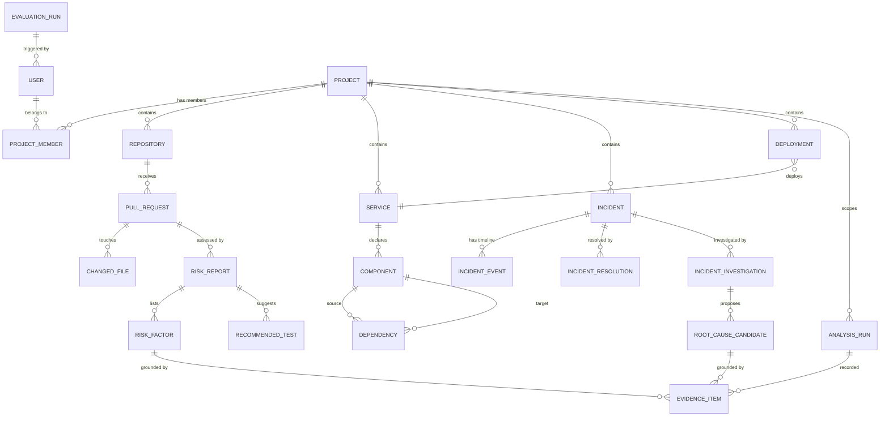

# Domain Model & Database Design

> Phase 0 deliverable. Entities, relationships, schema ownership, and invariants. The exact column set is finalized in the Phase 1 EF Core migrations; this document is the contract they implement.

## 1. Schema ownership

One PostgreSQL instance, two schemas, two migration owners:

| Schema | Owner | Tooling | Contains |
| --- | --- | --- | --- |
| `app` | ASP.NET Core | EF Core migrations | All business/domain tables below |
| `ai` | FastAPI AI service | Alembic migrations | `documents`, `document_chunks`, `embeddings` |

Cross-schema rule: the AI service never writes to `app`; the backend never writes to `ai`. The backend *reads* `ai` retrieval results only through the AI service API — not directly via SQL. This keeps the retrieval contract versioned and auditable. ([ADR-0003](adr/0003-single-postgres-schema-per-service.md))

## 2. ER diagram (app schema)

## 3. Entity catalog

ID strategy: `Guid` (client-generated, avoids enumeration and simplifies demo seeding). All tables carry `created_at` / `updated_at` (UTC) and use **soft delete** (`deleted_at`) only where history matters (projects, repositories, documents); hard delete elsewhere.

### Identity & access

| Entity | Key fields | Notes |
| --- | --- | --- |
| `users` | id, email, display_name, password_hash, roles (JsonB) | ASP.NET Core Identity user |
| `projects` | id, name, slug, description, created_at | Soft-deletable; isolates all data |
| `project_members` | project_id, user_id, role (Owner/Admin/Engineer/Viewer) | Composite PK; the basis of project-level authorization |

### Code model

| Entity | Key fields | Notes |
| --- | --- | --- |
| `repositories` | id, project_id, name, url, default_branch, language | One project may hold several |
| `services` | id, project_id, name, language, root_path | Deployable unit, e.g. `auth-api` |
| `components` | id, service_id, name, type (Class/Method/Function/Endpoint/Module), file_path, language, start_line, end_line | Symbol-level granularity for C# (Roslyn) |
| `dependencies` | id, source_component_id, target_component_id, type (Call/Import/Inherit/Reference/ApiCall), strength (1–5) | Directed edges; computed deterministically |

### Change model

| Entity | Key fields | Notes |
| --- | --- | --- |
| `pull_requests` | id, repository_id, number, title, description, branch, base_branch, status (Open/Merged/Closed), merged_at | A "change" in ChangeLens terms |
| `changed_files` | id, pull_request_id, file_path, status (Added/Modified/Deleted), additions, deletions, language, content_hash | Raw diff-level facts |

### Incident & deployment model

| Entity | Key fields | Notes |
| --- | --- | --- |
| `incidents` | id, project_id, title, severity (SEV1–SEV5), status, classification, affected_service_id, environment, started_at, detected_at, summary | The incident record submitted for investigation |
| `incident_events` | id, incident_id, occurred_at, type (Error/Log/Deployment/Metric), source, message, raw_data (JsonB) | Timeline entries, incl. stack traces and log excerpts |
| `incident_resolutions` | id, incident_id, resolved_at, root_cause, resolution, lessons_learned, resolved_by | Postmortem content; also feeds retrieval |
| `deployments` | id, project_id, service_id, environment, version, commit_sha, deployed_at, status (Success/Failed/RolledBack) | Enables "recent changes before incident" analysis |

### AI results

| Entity | Key fields | Notes |
| --- | --- | --- |
| `risk_reports` | id, pull_request_id, analysis_run_id, risk_level (Low/Medium/High/Critical), confidence, summary | Workflow A primary result |
| `risk_factors` | id, risk_report_id, title, description, severity | Each factor grounded by evidence |
| `recommended_tests` | id, risk_report_id, category (Unit/Integration/Regression/Manual), target_component_id, description | Test scenarios from the LLM |
| `incident_investigations` | id, incident_id, analysis_run_id, severity, classification, summary | Workflow B primary result |
| `root_cause_candidates` | id, investigation_id, title, description, confidence, status (Candidate/Confirmed/RuledOut) | Hypotheses, never presented as truth |
| `evidence_items` | id, run/result owner refs (risk_factor_id, root_cause_candidate_id), type (ChangedFile/Component/Dependency/Incident/Document/Deployment/Log), reference (file path / line / doc id / incident id), summary, ai_document_id | The grounding layer; every conclusion references these |
| `analysis_runs` | id, project_id, type (ChangeRisk/IncidentInvestigation), status (Queued/Running/Succeeded/Failed), model, model_version, prompt_version, latency_ms, input_tokens, output_tokens, estimated_cost_usd, validation_status, guardrail_status, retrieval_queries (JsonB), retrieved_documents (JsonB), tool_calls (JsonB), error, started_at, completed_at | AI observability record (§23 of the brief) |
| `evaluation_runs` | id, dataset_version, status, config (JsonB), metrics (JsonB), started_at, completed_at | Only real measured metrics are stored |
| `audit_logs` | id, occurred_at, user_id, **project_id**, action, resource_type, resource_id, ip_address, details (JsonB) | Append-only; covers mutations + tool calls. `project_id` added in Phase 1 so trails are queryable per project (null for non-project events such as login) |

### ai schema

| Entity | Key fields | Notes |
| --- | --- | --- |
| `documents` | id, project_id, repository_id?, document_type (SourceCode/OpenApi/Incident/Runbook/DeploymentRecord), file_path, language, service_id?, incident_id?, environment?, source, content_hash, status (Pending/Chunked/Embedded/Failed), ingested_at | Metadata carries the filter surface from §10 of the brief |
| `document_chunks` | id, document_id, chunk_index, chunk_type (File/Class/Method/Function/Section/Endpoint/…), content, char_start, char_end, heading_path | Semantic-boundary chunks, never fixed-N splits |
| `embeddings` | id, chunk_id, model, model_version, dimensions, vector (vector(768)…) | Keyed by model+version → supports re-indexing and cross-model evaluation |

## 4. Key relationships & invariants

- **Project isolation is enforced twice**: in SQL (every query filters by project id) and in the authorization layer (project-level policies) — never only in the UI.
- `analysis_runs` are the audit trail of AI: one per risk report / investigation, capturing model, prompt version, retrieval inputs, tokens, and cost. Results without a run are invalid.
- `evidence_items` reference either `ai_document_id` (retrieved chunks) or domain ids (incident, component, deployment). A risk factor / root-cause candidate with **zero** evidence is a validation failure, not a stored result.
- A `root_cause_candidate` is a **hypothesis**: `status` and `confidence` distinguish it from confirmed truth.
- Documents are immutable content + mutable status: `content_hash` drives idempotent re-ingestion; changing the embedding model bumps `model_version` and re-indexes without touching history.

## 5. Indexes & search support

- `dependencies(source_component_id)`, `dependencies(target_component_id)` — graph traversal.
- `changed_files(pull_request_id)`, `incidents(project_id, affected_service_id, started_at)`.
- Keyword search: Postgres `tsvector` GIN index on document chunk content (ai schema).
- Vector search: pgvector HNSW index on `embeddings(vector)` per model+dimensions; HNSW chosen over IVFFlat for better recall at portfolio scale with no tuning. Rebuilt when the embedding model changes.
- `analysis_runs(project_id, created_at desc)` for the trace/audit views.

## 5b. Phase 1 implementation status

Phase 1 created the **`app` schema** tables: `users`/Identity (AspNet*), `projects`, `project_members`, `repositories`, `services`, `incidents`, `incident_events`, `audit_logs` (migration `InitialCreate`). Notes vs. this document:

- `services.language` is nullable in Phase 1 (populated by ingestion in Phase 3).
- `incident_resolutions`, `deployments`, `components`, `dependencies`, `pull_requests`, `changed_files`, AI-result tables, and the whole `ai` schema are **not yet created** — they arrive with their owning phases (3/4/7).
- `project_members` keeps a composite key (project_id, user_id) per Phase 0.

## 6. Migrations strategy

- Backend: EF Core migrations in `ChangeLens.Infrastructure` (one migration set per phase, never edited after merge — new migration instead).
- AI service: Alembic migrations for the `ai` schema.
- Demo/eval data is **seed data via code**, versioned in `data/`, never migrations.
