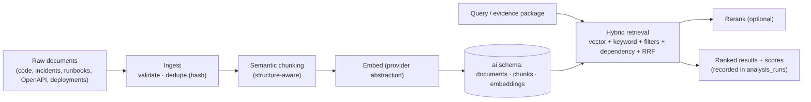

# RAG Architecture

> Phase 0 deliverable. How documents become retrievable, and how retrieval happens. Design goal: **hybrid retrieval with metadata filtering and dependency relationships — never vector-only** ([ADR-0004](adr/0004-hybrid-retrieval.md)).

## 1. Pipeline overview

## 2. Semantic chunking (never fixed-N splits)

Chunkers are selected by `documentType` and preserve the semantic hierarchy defined in the brief:

| Document type | Chunk hierarchy | Chunker implementation |
| --- | --- | --- |
| Source code (C#) | File → Class → Method (with signature + body; references to other symbols kept as text) | tree-sitter (C# grammar) — **retrieval granularity only**; deep symbol/dependency analysis is Roslyn's job in .NET ([ADR-0011](adr/0011-static-analysis-vs-chunking.md)) |
| Source code (JS/TS, Python) | File → Class/Function → Method | tree-sitter (best-effort) |
| JSON / YAML | Top-level object per chunk with path metadata | structural walk |
| OpenAPI | Endpoint → (method, request, response, tags) | path-item walk |
| Incident | Incident → (symptom, timeline, root cause, resolution, lessons learned) | structured fields, not raw text |
| Runbook (Markdown) | Heading hierarchy → sections; table rows preserved | Markdown AST |

Each chunk stores `chunk_type`, `heading_path` (e.g. `AuthClient/RefreshAsync`), `char_start/end`, and parent metadata (`file_path`, `language`, `service_id`, `incident_id`, `environment`, `document_type`, `project_id`). Chunk size target ~300–600 tokens with overlap only where the structure requires it (e.g. method body split).

## 3. Embeddings

- **Abstraction:** `EmbeddingProvider` interface with two implementations — `GeminiEmbeddingProvider` (API, free tier, 768-dim `gemini-embedding-2` default, configurable; dimension passed via `output_dimensionality`) and `MockEmbeddingProvider` (deterministic, offline/dev/tests, $0). The retired `text-embedding-004` is never a default (Phase 4 correction). See [ADR-0006](adr/0006-embedding-provider-abstraction.md).
- **Batch + cache:** embeddings requested in batches; identical content (same hash) never re-embedded.
- **Model-versioned storage:** `embeddings(chunk_id, model, version, vector)`. Changing the embedding model triggers re-indexing of affected documents; old vectors remain for evaluation comparisons ([ADR-0006]).
- **Dimensions are per-model:** vector column dimension matches the configured model; switching models is a migration + re-index event, surfaced in the UI ("re-index required").

## 4. Hybrid retrieval

Single search endpoint executes, per strategy:

1. **Pre-filter (mandatory + optional):** `project_id` is always applied server-side; optional filters from the metadata surface (`document_type`, `language`, `service_id`, `environment`, `incident_id`, `time range`). Filtering happens **before** scoring, not as post-hoc cuts.
2. **Vector leg:** embed the query → pgvector cosine similarity (HNSW index) with filters → top-k (k=50).
3. **Keyword leg:** Postgres full-text search (`tsvector` GIN, English + identifier-aware tokenization so `AuthClient` and `RefreshAsync` match) with the same filters → top-k (k=50).
4. **Dependency leg (Phase 4):** terms derived from the backend's Roslyn dependency graph — changed/impacted symbol names, dependency-path file names, and service names — searched over the same `project_id`-filtered scope → top-k (k=50). Dependency is a *different kind of evidence*, never blended into vector scores.
5. **Merge:** Reciprocal Rank Fusion (RRF, `k=60`) — rank-based, robust to score-scale differences between legs. Scores and per-source components are returned so the UI can show *why* a result surfaced.
6. **Optional rerank:** pluggable `Reranker` — MVP default is **no reranker** (RRF is sufficient at portfolio scale); local cross-encoder available via config; a Gemini/Vertex reranker can be added behind the same interface later (API-key reranking availability varies by account — never a hard dependency).

**Dependency relationships join retrieval (implemented Phase 4):** the backend runs Roslyn over the repository state, builds the dependency graph, and sends the change model (changed/impacted symbols, dependency edges/paths, impacted services) to the AI service. The AI service adds the dependency retrieval leg and renders every evidence item with a stable id (`chunk:`, `symbol:`, `dependency:`) so the LLM context is "similar code + what the change touches". Ranking is documented per leg: dependency terms rank candidates for *connectivity to the change*, not similarity to the change text.

## 5. Retrieval observability (feeds evaluation)

Every search records: normalized queries, applied filters, per-leg top results with scores, final merged ranking, latency, embedding tokens. The backend persists this in `analysis_runs.retrieval_queries` / `retrieved_documents`. The evaluation framework replays the same queries against ground truth to compute Recall@K, precision, MRR for each strategy ([ADR-0010](adr/0010-evaluation-first-class.md)).

## 6. Known limits & mitigations

| Limit | Mitigation |
| --- | --- |
| pgvector at very large scale (100M+ chunks) | Not an MVP concern; HNSW + filters scale fine to portfolio scale; document migration path to a managed vector store in Phase 11 notes |
| English-centric full-text tokenization for code | Custom identifier tokenizer (camelCase/snake_case splitting) is part of the keyword leg |
| Chunk boundary artifacts (method split mid-body) | Overlap within method bodies only; chunk_type metadata lets the LLM know it may need adjacent chunks — the backend can fetch siblings on request |
| Embedding model drift | Model-versioned embeddings + re-index workflow + evaluation detects quality regression before it ships |

## 7. Phase 3 implementation status (actual, not aspirational)

Phase 3 (commit `feat: implement phase 3 hybrid rag`) implemented the pipeline in the
AI service. This section records what is real in the code today; everything below is
verified against `ai-service/`.

**Implemented**

- **Ingestion** (`POST /internal/v1/ingest/documents`): `document → normalize → hash →
  structure-aware chunking → persist chunks → batch embeddings → persist vectors`.
  Idempotent: unchanged content (same sha256 of normalized content) skips re-chunking
  and re-embedding; changed content re-chunks and cascades old chunks; stale embedding
  model version triggers re-embed only. Batch failures are reported per chunk in the
  response (`errors`) and retried on the next ingest — never silently dropped.
- **Chunking**: tree-sitter code chunker (csharp, javascript, typescript, python) emitting
  Class/Interface/Method/Constructor/Property chunks with `namespace`/`class` metadata;
  unknown languages fall back to one honest File chunk (never a blind N-char split).
  Incident and Runbook chunkers split on headings and keep heading context in each chunk.
  `ApiDefinition`/`DeploymentRecord` use the heading-section fallback until their data
  sources land (Phase 4).
- **Embeddings**: `IEmbeddingProvider` protocol with `GeminiEmbeddingProvider`
  (`GEMINI_EMBEDDING_MODEL`, default `gemini-embedding-2`, 768-dim) and a deterministic
  `MockEmbeddingProvider` (gram-overlap vectors, $0, used by dev/tests). Dimension is
  validated on every vector; mismatches fail loudly. Embedding calls happen only during
  ingestion/re-index and query-time vector search — never at startup or on health checks.
- **Storage**: `ai` schema (`documents`, `document_chunks`, `embeddings`) migrated via
  Alembic (version table `ai.alembic_version_ai`), pgvector `vector(768)` column + HNSW
  (cosine) index, GIN index over a generated `content_tsv` (`simple` config — exact
  technical terms: `TimeoutException`, `401`, `JWT`, `retry`). Migrations are constrained
  to the `ai` schema only (ADR-0003).
- **Hybrid retrieval** (`POST /internal/v1/retrieval/search`): vector leg (pgvector cosine)
  + keyword leg (PostgreSQL FTS) with `project_id` applied inside every SQL statement
  (hard isolation — never trusted from input), optional `document_type`/`service_id`/
  `language`/`environment` filters, merged with configurable RRF (`RRF_K=60`). Results
  carry per-source scores (`vector`, `keyword` rank) so the UI can explain *why*.
- **RAG-fed analysis**: when the backend request has no `retrievedDocuments`, the analysis
  service auto-runs hybrid retrieval (change summary + changed-file names) and renders the
  hits as `<evidence id="chunk:<uuid>">`. The grounding validator enforces that every risk
  factor references a real evidence id from the index — invented ids fail validation and
  trigger bounded repair.
- **Demo corpus**: `data/demo-repository` (AcmePay, 24 C# files, compiles), 20 synthetic
  incidents, 5 runbooks, and a 20-case golden dataset (`data/golden-dataset/cases.json`).
  Seeding is a script: `ai-service/scripts/seed_demo.py` (idempotent).
- **Readiness** reports database reachability + vector extension availability; a live
  provider probe stays opt-in (`AI_READINESS_PROBE`) so health never spends tokens.

## 8. Phase 4 implementation status (actual, not aspirational)

Phase 4 (commit `feat: implement change intelligence`) added the **dependency retrieval
leg** and the change-model prompt context. This section records what is real in the code
today, verified against `backend/` and `ai-service/`.

**Implemented**

- **Roslyn analyzer** (`backend/.../Infrastructure/Analysis/RoslynAnalyzer.cs`): symbol
  extraction (classes, interfaces, methods, constructors, properties, fields), dependency
  edges (CALLS, REFERENCES_TYPE, IMPLEMENTS, INHERITS), in-memory `DependencyGraph` with
  direct dependencies/dependents and bounded traversal. Verified on the 24-file AcmePay
  demo: 31 classes, 31 methods, 6 constructors, 30 properties, 34+ dependency edges.
- **Symbol-level change analysis** (`ChangeAnalyzer.cs`): added/removed/modified symbol
  diffing (signature + body hash), configurable impact traversal (default depth 2), API
  impact (controller → route → HTTP method → action → DTOs), external-integration impact
  (HttpClient clients: endpoints, retry, timeout), dependency paths for retrieval.
- **Safe local-git change source** (`GitChangeSource.cs`): repository path restricted to a
  configured root, path-traversal/absolute-path/URI rejection, strict git-revision
  validation (no `..`, no leading `-`), git invoked with a fixed argument list only — no
  user-supplied command line, no shell, analyzed source is never executed.
- **Change-risk pipeline** (Workflow A): `POST /api/v1/analyses/change-risk` →
  `ChangeAnalysisEngine` (git base→target + Roslyn + graph) → enriched AI request →
  `analysis_runs` persistence → AI service auto-retrieval with the dependency leg →
  grounded risk report. The client never supplies evidence — the system discovers it.
- **Dependency retrieval leg** (`ai-service/app/retrieval/service.py`): terms from
  changed/impacted symbols + dependency paths + impacted services run as a third RRF list
  over the `project_id`-scoped scope; results carry `dependency` rank metadata.
- **Change-model prompt context** (`ai-service/app/llm/prompts.py` + `risk_v1.txt`): the
  evidence index now renders `symbol:` / `dependency:` ids alongside `chunk:` ids;
  changed/impacted symbols, dependency edges and paths render in a structured change
  section; per-chunk caps and total budgets (`MAX_EVIDENCE_CHUNKS`, `MAX_CHARS_PER_CHUNK`,
  context-token cap) bound the context. The grounding validator is unchanged: unknown ids
  still fail validation.
- **Demo scenario**: the working tree of `data/demo-repository` carries an UNCOMMITTED
  follow-up change in `TokenService.cs` (signing-key parsing extraction + a rotation
  fingerprint for monitoring) — a change under analysis is intentionally not committed;
  the engine resolves it against git HEAD and produces 5 changed symbols, 2 added
  symbols, 2 impacted symbols (incl. the `Program` DI registration), 10 relevant
  dependency edges and 2 dependency paths.

## 9. Phase 5 implementation status (actual, not aspirational)

Phase 5 (commit `feat: implement async incident investigation`) added **Workflow B** and
the **async job runner** ([ADR-0009](adr/0009-async-analysis-jobs.md)). This section
records what is real in the code today, verified against `backend/` and `ai-service/`.

**Implemented**

- **Async jobs** (backend): `POST /api/v1/incidents/{id}/investigate` → `202
  { analysisId, status, statusUrl }`; bounded in-process queue (`AnalysisJobQueue`,
  `Channel`, capacity + concurrency configurable); `AnalysisWorker` BackgroundService
  with graceful shutdown; `IncidentInvestigationOrchestrator` enforces `Queued → Running
  → Succeeded | Failed`, retries only transient AI failures (429/504/502, bounded
  backoff), applies a per-job timeout (default 600s), persists result JSONB + model +
  prompt version + retrieval snapshot, and audits the lifecycle. `GET /api/v1/analyses/{id}`
  polls; request-id idempotency reuses outstanding runs; queue-full persists
  `Failed(QUEUE_FULL)`.
- **Incident context** (`IncidentContextBuilder.cs`): normalized context (title, severity,
  status, environment, service, timestamps, chronological timeline, symptoms from error/log
  events, known facts, explicit unknowns) — nothing fabricated.
- **Incident retrieval** (`ai-service/app/services/analysis_service.py`): queries generated
  server-side from the context (title, symptom/error messages, service, symbol-like
  CamelCase terms) preserving exact identifiers for the keyword leg; the dependency leg
  steers by affected service + symbol-like terms. Evidence ids are `chunk:<uuid>` only.
- **Incident schema + grounding** (`responses.py`, `analysis_service.py`):
  `rootCauseCandidates[]` (per-candidate `evidenceIds` ≥ 1, `confidence` 0–1, `reasoning`,
  `unknowns`), `remediation` with `insufficientEvidence`, top-level `unknowns`,
  `evidence[]`. The deterministic grounding check rejects empty evidence-id lists and
  unknown ids (Pydantic `min_length=1` + index membership).
- **Prompt** (`app/llm/prompts/incident_v1.txt`): incident facts → timeline → symptoms →
  known facts → context unknowns → evidence package → evidence index, with the same
  layered system/data separation and injection sanitizer as `risk_v1`.

**Deferred (documented here so nobody claims otherwise)**

- Cross-encoder reranker — explicitly NOT implemented (MVP = RRF; revisit only if
  evaluation shows RRF insufficient).
- Structured (non-text) incident fields, OpenAPI path-item chunker, JSON/YAML structural
  chunker, and the identifier-aware tokenizer for the keyword leg.
- Per-analysis traces persist the **selected** evidence with per-leg attribution
  (Phase 7, docs/evaluation.md §5); full per-leg candidate lists are available in
  evaluation runs (the runner computes them per case).
- No measured accuracy metrics exist — the golden dataset defines *targets* only.
